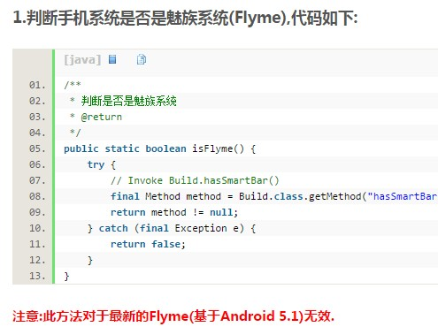

### 1、魅族推送服务是否支持所有Android平台？ 
魅族推送服务适用所有安卓系统，但仅在Flyme系统上有系统级的推送服务，包括基于YunOS的Flyme系统，及安装了Flyme系统的非魅族手机。
### 2、魅族推送SDK与其他推送SDK同时集成时是否会有冲突？
在与其他推送SDK同时集成时不会有冲突。
### 3、魅族推送平台的服务是收费服务吗？

基础推送功能是免费的，定制功能会考虑收费。
如需了解定制功能，请联系我们。

推送服务咨询邮箱：push_support@meizu.com
### 4、魅族推送平台是否可以统计到到达数、点击数等数据？ 
通知栏消息可以统计到推送数、接收数、展示数、点击数等数据，透传消息可以统计到推送数、接收数，展示数和点击数需客户端埋点上报。
### 5、按照Push SDK接入应用，为什么收不到推送消息？

在收不到推送消息时，可以按照以下方法进行排查：

1.订阅关系及开关排查：【配置管理】-【问题排查】查询设备在线、订阅关系

2.系统权限排查：【手机管家】-【权限管理】-【通知管理】查询通知栏消息是否打开

3.以上两个排查均无异常，请联系工作人员
### 6、在锁屏状态下可以收到推送消息吗？ 
在锁屏状态下可以收到推送消息。如若收不到请联系工作人员。
### 7、如何获得APP ID和APP Key？ 
APPID和APPKey统一在Push平台上注册应用并生成，已注册应用可以在【配置管理】-【应用配置】进行查询。未在Push平台上注册的应用，需要在Push.meizu.com重新创建生成。
### 8、魅族推送消息提示类型是否支持自定义？
魅族推送消息暂时不支持自定义通知提示，但是在高级设置中的设置通知提醒类型（震动、闪灯、声音）。用户收到消息时优先由系统设置项控制是否按照指定类型提醒。
### 9、应用配置登录的账号需要变更该如何处理？需要重新创建一个应用吗？
账户管理中可以更改主账户，无需重新申请。
### 10、Android版的SDK和哪个网络框架冲突吗？
不依赖任何第三方库，不存在冲突
### 11、SDK是否提供获取flyme版本号的api接口？ 
没有提供相关接口，只判断是否为Flyme系统。
### 12、Push SDK 一定要引入okhttp么？ 
不需要引入okhttp。
### 13、通过服务器传的参数，客户端获取一定要用getString？服务器接了API也是string类型的？ 
全部都会转为string
### 14、获取taskid的任务推送的限制是多少？
单条没有限制，批量用户为1000次/天，可以进行调整。
### 15、API调用频率限制会取消限制或拿到一个很大的限制数字吗？
API推送速率按照注册应用速率限制，默认500条/秒 ，API一天的调用频率会放开，但是会有一个较大的限制数字，后续会有一个统一的各个接口的限制文档出来。
### 16、标签订阅/取消，设置别名，获取用户标签列表，能否在服务端操作？
标签订阅取消和用户标签列表暂时不会开放服务端操作。
### 17、PushId及用户订阅关系在用户重装后是否会发生变化？
用户重装后不会有变化。
### 18、一个设备只可设置一个别名？
别名只与应用有关，与设备无关，一个设备可以有多个别名，一个应用只可有一个别名。
### 19、PushManager没有clear所有通知的方法吗？调系统的notification的cancel，是否可移除？ 
Pushmanager没有clear所有通知的方法，调系统的notification的cancel无法去掉。 
### 20、 SDK里的Utility.isFlymeRom()不能用来校验魅族手机么？ 有没有推荐的方法，可以校验是flyme系统的？

### 21、更多问题
请查看issues
如还没解决你的问题？请联系我们

推送平台技术交流QQ群：488591713

推送服务咨询邮箱：push_support@meizu.com

